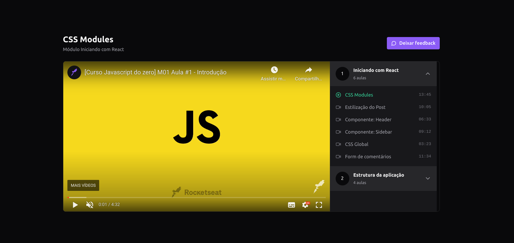

# Player de Video - React



---

<br/>
<br>
<br>

# Sobre

<p>
  Este projeto em React foi desenvolvido com o objetivo de praticar conceitos do Redux e Zustand, ao mesmo tempo em que oferece uma experiência interativa de reprodução de vídeos. O projeto consiste em um reprodutor de vídeos que exibe um vídeo principal em um lado da tela e, no outro lado, apresenta módulos e aulas relacionados aos vídeos.

O foco principal dessa implementação foi explorar o gerenciamento de estado utilizando duas bibliotecas diferentes: Redux e Zustand. Ambas são amplamente utilizadas para controlar o estado global em aplicações React, porém possuem abordagens distintas.

</p>

<br>
<br>

# 🏇 Tecnologias e ferramentas usadas

- React
- TypeScript
- Redux
- Zustand
- Radix
- Axios
- Tailwind

<br>
<br>

# 💻 Clonando o projeto para sua máquina

1. Abra o terminal de seu computador.
2. Acessar a pasta de seus projetos.
3. Estando dentro da pasta de seus projetos, execute os comandos abaixo para clonar o projeto online:

```bash
# Para fazer o download do projeto para seu computador
$ git clonegit@github.com:marlisonmourao/player-video.git

# Para baixar as dependências do projeto
$ npm install

# Abra com o editor vscode
$ code .
```

4. Pronto, agora basta testar e fazer as alterações que desejar.

<br>
<br>

## 📄 Licença MIT

- Consulte a [LICENÇA](LICENSE) para mais informações.
  <br>
  <br>

---

<p align="center"> Made with 💜 by <a href="https://github.com/marlisonmourao"> Marlison Mourão </a></p>
